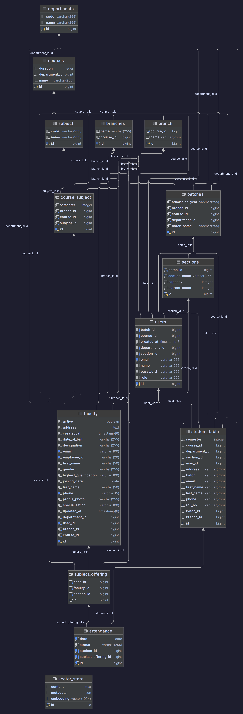

# AI-Powered ERP

Independent academic ERP with JWT role portals (Admin, Faculty, Student) and **SHERPAL**, a RAG assistant over uploaded documents.

Backend: **Spring Boot 3.5.14** (Java 21) + PostgreSQL + PGVector. Frontend: **React 18 + Vite 5 + Tailwind CSS**.

Work in progress. Auth, dashboards, admin CRUD, attendance, document indexing, and SHERPAL chat work. Fees, grades, and some sidebar pages are not built yet.

[](https://spring.io/projects/spring-boot)
[](https://www.oracle.com/java/)
[](https://react.dev/)
[](https://vitejs.dev/)
[](https://tailwindcss.com/)
[](https://www.postgresql.org/)

---

## Features

**Auth**
- `POST /auth/login` — email/password → JWT (`id`, `jwt`, `role`, `name`, `email`)
- Roles: `ADMIN`, `FACULTY`, `STUDENTS` (UI maps `STUDENTS` → Student)
- `/admin/**` is ADMIN-only. `/faculty/**` is ADMIN + FACULTY. `/students/**` is ADMIN + STUDENT/STUDENTS. CORS enabled.

**Admin**
- Register admin / faculty / student; update/delete students; update faculty; change user password
- Stats: students, faculty count, departments, courses
- Department + course create; lookup departments → courses → branches
- Assign subjects to faculty (department/course/branch/batch/section)
- Student auto batch/section on register; faculty/student IDs generated in backend
- RAG upload: PDF, DOC, DOCX (multipart, 100MB)

**Faculty**
- Profile, assigned offerings, attendance roster by date, mark PRESENT / ABSENT / LEAVE
- Profile update + password change APIs (UI still mainly on the dashboard)

**Student**
- Dashboard profile snapshot; edit profile; change password (current + new)
- Attendance: overall %, subject totals, date-wise records

**SHERPAL**
- Role endpoints: `POST /admin|faculty|students/ask-to-sherpal`
- Answers from PGVector docs + authenticated profile (students also get attendance context)
- Widget: drag/resize, sound, typing, markdown tables, quick prompts
- Follows OS dark/light preference

---

## Tech stack

**Backend:** Java 21, Spring Boot 3.5.14, Spring Security + JJWT 0.13.0, Spring Data JPA, PostgreSQL, Lombok, Validation, Apache POI 5.4.1, Spring AI 1.1.4 (Ollama + PGVector + PDF/Tika readers).

**Frontend:** React 18.3, Vite 5.3 (dev proxy to `:8080`), Tailwind 3.4 (`darkMode: class`), React Router 6.26, Context JWT (`erp_token` in localStorage). Logo: `frontend/public/Mainlogoerp.png`.

**AI:** Ollama `qwen3-embedding:0.6b` (1024-dim) + `phi4-mini:3.8b`. Embed + chat via backend only.

---

## Prerequisites

- JDK 21+, Node 18+, npm, PostgreSQL 14+ with **pgvector**, Git
- [Ollama](https://ollama.com/download) with both models pulled

---

## Setup

### 1. Database

```sql
CREATE DATABASE erpdemo;
\c erpdemo
CREATE EXTENSION IF NOT EXISTS vector;
```

Set secrets in the shell (do not commit them):

```powershell
$env:DB_PASSWORD = "your-local-postgres-password"
$env:JWT_SECRET = "a-long-local-development-secret"
```

macOS/Linux: `export DB_PASSWORD=...` and `export JWT_SECRET=...`.

`src/main/resources/application.properties` (non-secrets; change if needed):

```properties
spring.datasource.url=jdbc:postgresql://localhost:5432/erpdemo
spring.datasource.username=postgres
spring.datasource.password=${DB_PASSWORD:}
spring.jpa.hibernate.ddl-auto=update
jwt.secret=${JWT_SECRET:}
spring.ai.ollama.base-url=http://localhost:11434
spring.ai.ollama.embedding.options.model=qwen3-embedding:0.6b
spring.ai.ollama.chat.options.model=phi4-mini:3.8b
spring.ai.vectorstore.pgvector.initialize-schema=true
spring.ai.vectorstore.pgvector.dimensions=1024
```

`dimensions` must match the embedding model. After a model/dim change: `DROP TABLE IF EXISTS vector_store;` then restart.

**First admin:** `/admin/register-admin` needs an ADMIN JWT. Insert one `users` row (`role = 'ADMIN'`, BCrypt password) after Hibernate creates tables, then log in.

### 2. Ollama

```powershell
ollama serve
ollama pull qwen3-embedding:0.6b
ollama pull phi4-mini:3.8b
ollama list
```

### 3. Backend (port 8080)

```powershell
# Windows
.\mvnw.cmd spring-boot:run

# macOS / Linux
./mvnw spring-boot:run
```

### 4. Frontend (port 5173)

```bash
cd frontend
npm install
npm run dev
```

Open `http://localhost:5173`. Vite proxies `/auth`, `/admin`, `/students`, `/faculty` to `http://localhost:8080`.

**RAG order:** PostgreSQL + `vector` → Ollama + models → backend → login as admin → upload PDF/DOC/DOCX → ask SHERPAL from any portal.

Sample docs: [Dropbox folder](https://www.dropbox.com/scl/fo/bdknfl8ppsod4oxo0yr0k/ABAh9HgxKbn_JoPBr7YKMto?rlkey=90sya82ekh35aioqezv590atq&st=ibn4xrha&dl=0).

---

## Environment variables

| Variable | Used for |
| :--- | :--- |
| `DB_PASSWORD` | PostgreSQL password |
| `JWT_SECRET` | JWT signing key |

Gemini keys in `application.properties` are commented out (Ollama is active).

---

## Folder structure

```
├── src/main/java/com/chaiorcode/mycode/
│   ├── Controller/     Auth, Admin, Faculty, Student
│   ├── Service/        Auth, academic, attendance, Sherpal, RAG chunk/retrieve
│   ├── Entity/ Repo/ DTO/ Enum/
│   ├── security/       JWT filter + SecurityFilterChain
│   └── config/         ChatClient bean
├── src/main/resources/application.properties
├── frontend/src/
│   ├── pages/          Login; admin/faculty/student dashboards; student profile/attendance/password
│   ├── layouts/        AdminLayout, FacultyLayout, StudentLayout + Sidebar/Navbar/SHERPAL
│   ├── components/     KnowledgeUploadPanel, SubjectAssignmentPanel, FacultyAttendancePanel, RagChatbot
│   ├── context/        AuthContext
│   ├── routes/         ProtectedRoute
│   └── services/       api, auth, admin, faculty, student, rag
├── ForREADME/          Screenshots
└── pom.xml
```

---

## Main APIs

| Method | Path | Access |
| :--- | :--- | :--- |
| `POST` | `/auth/login` | Public |
| `POST` | `/admin/register-admin` `/register-faculty` `/register-student` | ADMIN |
| `GET` | `/admin/get-all-students` `/get-student-records` `/user-options` `/get-faculty-count` `/get-departments` `/get-courses` `/get-branches` `/get-course-count` | ADMIN |
| `PUT` | `/admin/student-update` `/faculty-update` `/change-password` | ADMIN |
| `DELETE` | `/admin/student-delete` | ADMIN |
| `POST` | `/admin/update_department` `/insert-course` `/subject-assignment` `/assign-subject-to-faculty` `/upload-documents` `/ask-to-sherpal` | ADMIN |
| `GET` | `/admin/subject-assignment/{faculty,subjects,sections,batches}` | ADMIN |
| `GET` | `/faculty/my-subjects` `/attendance/roster` `/view-profile` | FACULTY |
| `POST` | `/faculty/attendance` `/ask-to-sherpal` | FACULTY |
| `PUT` | `/faculty/faculty-update` `/faculty-change-password` | FACULTY |
| `GET` | `/students/view-profile` `/attendance` | STUDENT |
| `PUT` | `/students/update` `/student-change-password` | STUDENT |
| `POST` | `/students/ask-to-sherpal` | STUDENT |

UI routes: `/login`, `/admin/dashboard`, `/faculty/dashboard`, `/student/dashboard`, `/student/attendance`, `/student/profile`, `/student/change-password`. Extra sidebar links are marked Soon.

---

## Screenshots

### Login


### Admin dashboard


### SHERPAL


### Student dashboard


### Student attendance


### Database schema


---

## Not built yet

- WebSocket alerts, fee payments, grade-card PDF export
- Dedicated admin Students / Faculty / Departments pages (logic lives on the admin dashboard)
- Faculty profile / teaching / password pages (APIs exist; attendance is on the dashboard)

---

## Author

[Ranjeet Prajapati](https://github.com/prajapatiiranjeet) · [prajapatiiranjeet/Ai-Powered-ERP](https://github.com/prajapatiiranjeet/Ai-Powered-ERP)
